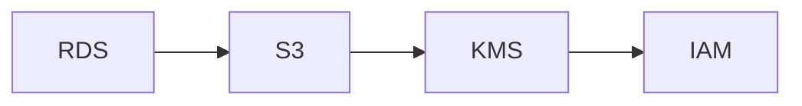

# InfraTales | AWS CDK KMS Encryption with IAM Roles: One Stack for EC2, S3, and RDS

**AWS CDK (TYPESCRIPT) reference architecture — security pillar | advanced level**

> Your EC2 instances have S3 access via long-lived IAM credentials stored in environment variables, your RDS snapshots are unencrypted, and your security team is asking for an audit trail you cannot produce. Every manual permission grant is undocumented, unreviewable, and one job-change away from becoming a permanently over-privileged ghost account. This repo addresses the compliance and governance gap by codifying EC2, S3, IAM, RDS, and KMS configuration as versioned, auditable CDK — so your security posture is a pull request, not a wiki page.

[](LICENSE)
[](CONTRIBUTING.md)
[](https://aws.amazon.com/)
[-IaC-purple.svg)](https://aws.amazon.com/cdk/)
[](https://infratales.com/aws-cdk-kms-encryption-with-iam-roles-for-rds-and-s3/)
[](https://infratales.com)


## 📋 Table of Contents

- [Overview](#-overview)
- [Architecture](#-architecture)
- [Key Design Decisions](#-key-design-decisions)
- [Getting Started](#-getting-started)
- [Deployment](#-deployment)
- [Docs](#-docs)
- [Full Guide](#-full-guide-on-infratales)
- [License](#-license)

---

## 🎯 Overview

The stack provisions a KMS CMK with automatic key rotation enabled as the encryption anchor for the entire environment, applied to S3 bucket server-side encryption, RDS storage encryption, and EC2 EBS volumes [from-code]. IAM roles and policies are synthesized by CDK constructs rather than managed through the console, meaning every permission boundary is expressed as TypeScript and tracked in git [from-code]. The environment suffix pattern via CDK context allows the same stack to deploy dev, staging, and prod with differentiated resource naming and removal policies — DESTROY in dev, RETAIN in prod [inferred]. The non-obvious design choice is using a single CMK per environment rather than per-service keys, which simplifies key policy management but creates a shared blast radius if the key policy is misconfigured [editorial].

**Pillar:** SECURITY — part of the [InfraTales AWS Reference Architecture series](https://infratales.com).
**Target audience:** advanced cloud and DevOps engineers building production AWS infrastructure.

---

## 🏗️ Architecture



> 📐 See [`diagrams/`](diagrams/) for full architecture, sequence, and data flow diagrams.

> Architecture diagrams in [`diagrams/`](diagrams/) show the full service topology (architecture, sequence, and data flow).
> The [`docs/architecture.md`](docs/architecture.md) file covers component responsibilities and data flow.

---

## 🔑 Key Design Decisions

- Single CMK per environment reduces key management overhead but means a misconfigured key policy can lock out S3, RDS, and EBS simultaneously — per-service keys would isolate blast radius at the cost of maintaining a separate key policy per resource type [editorial]
- KMS automatic key rotation rotates the backing key material annually but does not re-encrypt existing data — existing ciphertexts remain decryptable with old material indefinitely, which satisfies most compliance frameworks but surprises engineers expecting full re-encryption [inferred]
- CDK RemovalPolicy.DESTROY on dev KMS keys means a cdk destroy in the wrong environment could make encrypted snapshots permanently unreadable if RDS deletion protection is not separately enforced via a DeletionProtection: true property on the DatabaseInstance construct [inferred]
- Environment suffix via CDK context rather than environment variables means a missing --context environmentSuffix flag at synth time silently falls back to 'dev' defaults, which could deploy dev-grade removal policies against a prod AWS account if the pipeline is misconfigured [from-code]
- Encoding IAM policies in CDK TypeScript gives you type safety and reviewability but means every permission change requires a full CDK deploy cycle of roughly 3-8 minutes — there is no break-glass path for emergency permission grants without drifting from IaC state; SSM Parameter Store or AWS IAM Access Analyzer would need to compensate for that gap [editorial]

> For the full reasoning behind each decision — cost models, alternatives considered, and what breaks at scale — see the **[Full Guide on InfraTales](https://infratales.com/aws-cdk-kms-encryption-with-iam-roles-for-rds-and-s3/)**.

---

## 🚀 Getting Started

### Prerequisites

```bash
node >= 18
npm >= 9
aws-cdk >= 2.x
AWS CLI configured with appropriate permissions
```

### Install

```bash
git clone https://github.com/InfraTales/<repo-name>.git
cd <repo-name>
npm install
```

### Bootstrap (first time per account/region)

```bash
cdk bootstrap aws://YOUR_ACCOUNT_ID/YOUR_REGION
```

---

## 📦 Deployment

```bash
# Review what will be created
cdk diff --context env=dev

# Deploy to dev
cdk deploy --context env=dev

# Deploy to production (requires broadening approval)
cdk deploy --context env=prod --require-approval broadening
```

> ⚠️ Always run `cdk diff` before deploying to production. Review all IAM and security group changes.

---

## 📂 Docs

| Document | Description |
|---|---|
| [Architecture](docs/architecture.md) | System design, component responsibilities, data flow |
| [Runbook](docs/runbook.md) | Operational runbook for on-call engineers |
| [Cost Model](docs/cost.md) | Cost breakdown by component and environment (₹) |
| [Security](docs/security.md) | Security controls, IAM boundaries, compliance notes |
| [Troubleshooting](docs/troubleshooting.md) | Common issues and fixes |

---

## 📖 Full Guide on InfraTales

This repo contains **sanitized reference code**. The full production guide covers:

- Complete AWS CDK (TYPESCRIPT) stack walkthrough with annotated code
- Step-by-step deployment sequence with validation checkpoints
- Edge cases and failure modes — what breaks in production and why
- Cost breakdown by component and environment
- Alternatives considered and the exact reasons they were ruled out
- Post-deploy validation checklist

**→ [Read the Full Production Guide on InfraTales](https://infratales.com/aws-cdk-kms-encryption-with-iam-roles-for-rds-and-s3/)**

---

## 🤝 Contributing

See [CONTRIBUTING.md](CONTRIBUTING.md) for guidelines. Issues and PRs welcome.

## 🔒 Security

See [SECURITY.md](SECURITY.md) for our security policy and how to report vulnerabilities responsibly.

## 📄 License

See [LICENSE](LICENSE) for terms. Source code is provided for reference and learning.

---

<p align="center">
  Built by <a href="https://www.rahulladumor.com">Rahul Ladumor</a> | <a href="https://infratales.com">InfraTales</a> — Production AWS Architecture for Engineers Who Build Real Systems
</p>
